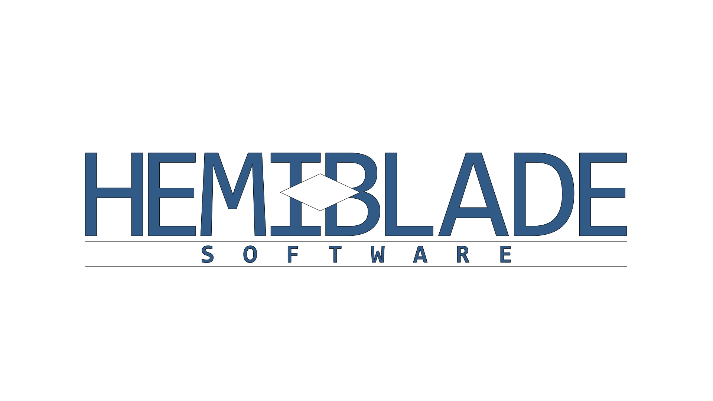
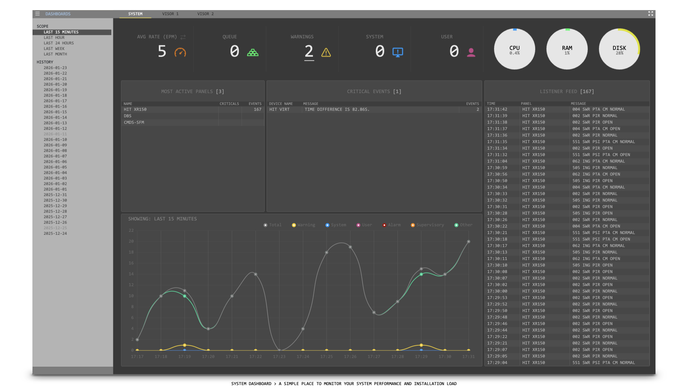

# Hemiblade Software

> Advanced technology solutions for enterprise automation and access control.

## About Us

At Hemiblade Software, we specialize in developing high-performance technology infrastructure for physical security management, hardware automation, and enterprise monitoring.

We help organizations and industries transform their operations through digital solutions, ensuring operational continuity, high availability, and a higher level of security and integration.

## Our Solutions

| Solution | Description |
|---|---|
| **Physical Access Control** | Integration of biometrics, RFID cards, and advanced identity management platforms. |
| **Video and Monitoring Systems** | Integrated real-time video management solutions for supervision and operational analysis. |
| **Hardware Automation** | Efficient connection between physical devices, sensors, and enterprise software platforms. |
| **Custom Platforms** | Centralized software development tailored to the specific scale and needs of each client. |

## Why Choose Us

| Pillar | Commitment |
|---|---|
| **Reliability** | Architectures designed to run 24/7 without interruption. |
| **Innovation** | Use of the latest industry standards in software and security. |
| **Scalability** | Solutions that grow with your business needs. |
| **Specialized Support** | Direct technical support and ongoing guidance for every project. |

  

    
  

  

    
  

  

    
  

## Contact and Support

- **Email:** contact@hemiblade.com
- **Support:** soporte@hemiblade.com
- **Website:** [hemiblade.com](https://hemiblade.com)
- **Location:** Dominican Republic
